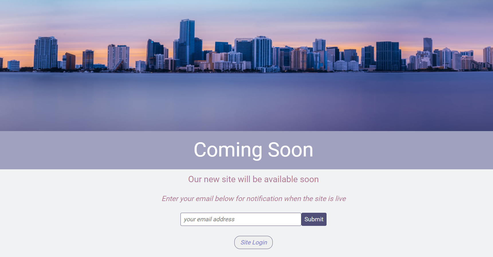

<!-- PROJECT LOGO -->
<br />
<p align="center">
  <a href="https://github.com/piyook/website-maintain-mode">
    
  </a>

  <h3 align="center">Simple Website Maintain Page</h3>

  <p align="center">
    Website Maintainence Page with URL User / Admin Bypass and Email Enquiry Form
    <br />
  </p>
</p>


<!-- TABLE OF CONTENTS -->
<details open="open">
  <summary><h2 style="display: inline-block">Table of Contents</h2></summary>
  <ol>
    <li>
      <a href="#about-the-project">About The Project</a>
      <ul>
        <li><a href="#built-with">Built With</a></li>
      </ul>
    </li>
    <li>
      <a href="#getting-started">Getting Started</a>
      <ul>
        <li><a href="#prerequisites">Prerequisites</a></li>
        <li><a href="#installation">Installation</a></li>
      </ul>
    </li>
    <li><a href="#usage">Usage</a></li>
    <li><a href="#contact">Contact</a></li>
  </ol>
</details>


<!-- ABOUT THE PROJECT -->
## About The Project
<p align="center">
 
 </p>
 <br>
 </p>
 A simple low security application meant to deter casual visitors from entering a site under maintenance, and instead display a responsive maintain or under construction page.<br><br> 
 The maintain page will show if the maintain flag is set to ON.<br>
 The maintain mode can be set or unset with a simple URL command with the admin password.<br>
 Authorized users can be given a password to access the site either through a URL Link or by entering the password on the maintain page site.<br>
 Email Addresses can be collected for users who want to know when the site is live.<br>
 <br>

### Built With

* PHP
* Javascript
* HTML


## Getting Started

The project can be run in a docker-container for development and test purposes.

Just type

```sh
    docker-compose up -d server
```

Access will be through http://localhost:8000

The src folder is bind mounted to the docker container www/html/var and so local changes in an IDE will be
reflected in the container. and the web browser.

Otherwise use a local LAMP stack such as XAMMP or WAMMP can be used.

### Prerequisites

Docker and Docker-Compose needs to be installed to run the container. 

### Installation

No dependencies required. Code can be copied to the desired web root.<br><br>


## Usage

IMPORTANT : The maintain_src folder should not be placed in the public web root. It should be placed one level below the public folder and not be accessible from the broswer. The .htaccess file has been provisioned to prevent this for an apache server - for other servers (such as NGINX) use the relevant configutations to prevent access to private folders.

1. The bootstrap PHP snippet below needs to be placed in the public folder and on the header of each page on the site.

```code
    session_start();
    require __DIR__ . "/../maintain_src/bootstrap.php";
```
2. Use the .env.php.example file to enter site details and admin and authorised user passwords.<br>
Rename this file .env.php.<br>
NOTE: Passwords are not hashed since this is a low security application meant to deter casual visitors from
enetering a site under maintenance or being built.

3. Access to the site can be controlled by:
    i. Authorised Users can be supplied a password and this added to the URL in the format
    ```code
        url?secret=password
    ```
    Access can also be given by visiting the URL and entering the password into the 'Site Login' form.

    Once access is granted a SESSIOM COOKIE is set up that keeps the visitor away from the maintain page so log as  the browser is open.

    ii. Admin users can also access the site in the same way by entering their password as above.

4. Maintain Mode UP and DOWN

    Maintain mode can be set up or down by entering the following into the URL

    maintain mode OFF
    ```code
        URL?maintainMode=off&password=admin_password
    ```

    or

    maintain mode ON
    ```code
        URL?maintainMode=on&password=admin_assword
    ```

5.  Email Contact

    Visitors can register their email address to be alerted when the site is live. Set up your email address in the 
    .env.php file. For best results make sure that this email address is on the same server as the site - this way your emails wont be blocked a spam.

6.  Security

    A simple security system was put in place to monitor log-ins and email addresses to throttle access and prevent bulk email spamming and hinder brute force attacks.
    This is not a high security application so measures are simplistic but enough for this application.
    Throttling time can be set in the .env.php file in seconds delay between multiple succesive attempts from the same IP address. The default of 15s should be enough to slow brute force enough to be non-worthwhile without impacting on user expereince for genuine users.

7. Customization

    The maintain.php file in maintain_src/views can be modified to add different images, colours and effects for a custom maintain page.

## Contact

Piyook - [@piyookD](https://twitter.com/piyookD) - email piyook@piyook.com

Project Link: [https://github.com/piyook/vue-modal](https://github.com/piyook/vue-modal)


